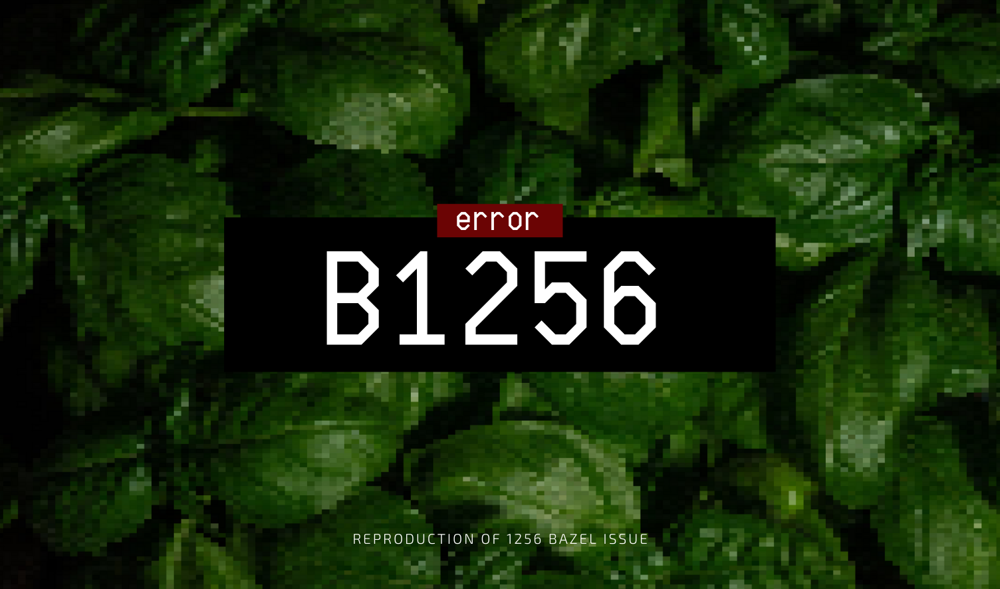

# b - 1256

A repository to reproduce [1256 bazel issue] and coresponding [StackOverflow question].



## Problems description

As described in [StackOverflow question] the problem hides in
dependecies configuration. There are some additional problems.
They are described in Problem description section.

### Borer

For example we need `borer-core` of version `1.6.3`.
We [define][borer-define] and [install][borer-install] it in the `Workspace` file.
This `jar` we then [use][borer-use] it in our `some-borer/BUILD` file.

We use [`deriveAllCodecs`] in our code. And it uses [macroses inside][deriver-macro].
So we use [`scala_macro_library`].

But at compilation time we faced the issue, that JMV cannot find `io.bullet.borer.deriver.Deriver` class. But it is precompiled and already [exists][deriver-exists].

To reproduce run:

```bash
bazel build //some-borer:lib
```

You should see the error caused by: `Worker process did not return a WorkResponse`.

## How to build

### Build specific target

To build specific target run:

```bash
bazel build //<name>:<mode>
```

where *`name`* can be `some-borer`, `some-logger` or `some-spark`
and *`mode`* can be `lib`.

### Build all targets

To build all targets at once in this repo use

```bash
bazel build //...
```

## Used technologies

| Technologie            | Version                                                            |
|:-----------------------|:-------------------------------------------------------------------|
| `scala`                | `2.12`                                                             |
| `rules_jvm_external`   | `31701ad93dbfe544d597dbe62c9a1fdd76d81d8a9150c2bf1ecf928ecdf97169` |
| `rules_scala`          | `5df8033f752be64fbe2cedfd1bdbad56e2033b15`                         |
| `bazel`                | `bazel 4.0.0-homebrew`                                             |

[borer-define]: https://github.com/sierikov/b1256/blob/main/WORKSPACE.bazel#L66-L67
[borer-install]: https://github.com/sierikov/b1256/blob/main/WORKSPACE.bazel#L104-L105
[borer-use]: https://github.com/sierikov/b1256/blob/main/some-borer/BUILD.bazel#L14-L15
[`deriveAllCodecs`]: https://github.com/sierikov/b1256/blob/main/some-borer/src/main/com/some/borer/Some.scala#L16
[deriver-macro]: https://sirthias.github.io/borer/borer-derivation/faq.html#:~:text=sub-type%20is%20already%20available%20at%20the%20deriveAll...%20macro%20call%20site%20then%20this%20implicit%20will%20be%20used
[deriver-exists]: https://github.com/sirthias/borer/tree/master/derivation/src/main/scala/io/bullet/borer/deriver

[1256 bazel issue]: https://github.com/bazelbuild/rules_scala/issues/1256
[StackOverflow question]: https://stackoverflow.com/questions/66640581/bazel-scala-failed-worker-process-did-not-return-a-workresponse

[`scala_macro_library`]: https://github.com/bazelbuild/rules_scala/blob/master/docs/scala_macro_library.md
